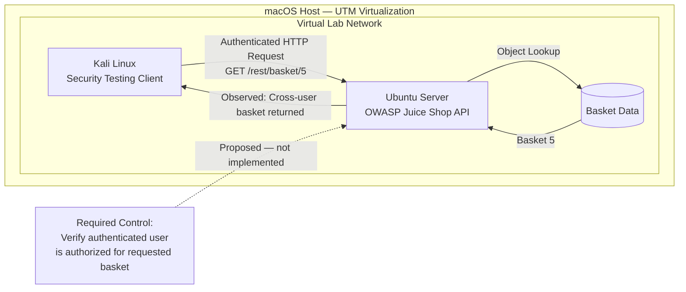

# Lab Architecture

## Purpose

This lab provides an isolated environment for testing web application security
controls without exposing intentionally vulnerable services to the physical
home network.

## Components

### Kali Attacker VM

Role:
Security testing workstation.

Responsibilities:

- Send controlled requests to the target application.
- Manipulate API requests and object identifiers.
- Capture evidence of security-control failures.
- Perform authorization testing.

### Ubuntu Target VM

Role:
Application hosting environment.

Responsibilities:

- Host the intentionally vulnerable OWASP Juice Shop application.
- Provide the target API and application services.
- Remain separated from the physical LAN by the virtualization boundary.

### OWASP Juice Shop

Role:
Intentionally vulnerable web application used as the security assessment
target.

The Basket API was used to demonstrate an object-level authorization failure.

### UTM Virtualization Layer

Role:
Provides the virtualized network and compute boundary between the lab
environment and the physical host/network.

The lab does not require exposing the vulnerable application directly to the
physical LAN.

---

## Logical Architecture

    Physical Home Network
             |
             |
        macOS Host
             |
        UTM Boundary
             |
       Lab Network
        /       \
       /         \
Kali Attacker   Ubuntu Target
                    |
              OWASP Juice Shop

---

## Primary Data Flow

    Kali Attacker
         |
         | HTTP/API request
         v
    Juice Shop API
         |
         | authentication
         v
    Authenticated Identity
         |
         | authorization decision
         v
    Basket Resource

The security failure occurs when the application authenticates the requester
but does not adequately enforce authorization between the authenticated
identity and the requested basket object.

---

## Trust Boundaries

### TB-01 — Physical Network / Virtual Lab

The virtualization layer separates the security-testing environment from the
physical home network.

Security objective:

Intentionally vulnerable services should not require direct exposure to the
physical LAN.

### TB-02 — Client / Application

Requests originating from the client are untrusted.

Security objective:

Object identifiers, parameters, headers, and other client-controlled values
must not be trusted as authorization decisions.

### TB-03 — Authentication / Protected Resources

Successful authentication establishes identity but does not automatically
authorize access to every application object.

Security objective:

Authorization must be evaluated for each protected resource.

---

## Security Assumptions

- Testing is performed only against systems intentionally deployed within the
  user's controlled lab.
- The vulnerable application is not intended for public exposure.
- Client-controlled identifiers are considered untrusted input.
- Authentication and authorization are treated as separate security controls.
- Authorization decisions must be enforced server-side.

---

## Primary Security Control

For every protected object request:

    authenticate user
           |
           v
    determine identity
           |
           v
    identify requested object
           |
           v
    evaluate authorization
        /       \
      allow     deny
       |          |
    resource    403

The object identifier selects a resource.

It does not grant permission to that resource.
## Architecture and Authorization Boundary

### Control Implementation Status

| Control or activity | Status |
|---|---|
| Authenticated request to own basket | Tested — HTTP 200 recorded |
| Cross-user basket access | Tested — HTTP 200 recorded |
| Server-side object-level authorization | Proposed — not implemented |
| Cross-user denial after remediation | Not tested |
| Authorization regression tests | Designed — not executed |
| Authorization monitoring and alerting | Proposed — not implemented |

The captured JSON responses report application-level `status: success`.
HTTP 200 results are recorded separately in `lab-notes.md`.

This project demonstrates a vulnerability and specifies its architectural
remediation. It does not claim that the Juice Shop source code was patched.
